## Overview
In this project I have implemented a PointNet based architecture for classification and segmentation with point clouds without the tranformation blocks. In the first two sections I focus on implementing, training and testing models. In the third section I quantitatively analyze model robustness. 

`models.py` is where you model structures are defined. `train.py` loads data, trains models, logs trajectories and saves checkpoints. `eval_cls.py` and `eval_seg.py` contain script to evaluate model accuracy and visualize segmentation result. Feel free to modify any file as needed.

## Data Preparation
Download zip file (~2GB) from https://drive.google.com/file/d/1wXOgwM_rrEYJfelzuuCkRfMmR0J7vLq_/view?usp=sharing. Put the unzipped `data` folder under root directory. There are two folders (`cls` and `seg`) corresponding to two tasks, each of which contains `.npy` files for training and testing.


## Classification Model

### Test Accuracy: 97.17 @ Epoch 52

#### Confusion Matrix on Test Set


Discussion: Chairs clearly have the best performance with no incorrect classifications. It also seems that the number of examples for chairs are much higher than the other two categories

#### Testing data Examples

True/Predicted | Chairs | Vases | Lamps 
---|---|---|---
Chairs |  | NA | NA 
Vases |  |  |  
Lamps |  |  |  

Discussion: The above grid is structured similar to a confusion matris to show a representative example of correct/incorrect predictions. 

- The model performs very well on the Chairs class, making no mistakes
- The errors made in Vase classification are reasonable. Without the plant in it the vase that was missclassified as a chair doesn't look much like a vase and the vase missclassified as a lamp has similar features as the lamp in the bottom right.
- The Lamp misclassified as a chair could just as well be interpreted as an inverted drummers throne (the seat a drummer in a band would sit on), it's legs are similar to the legs on the correctly classified chair image above. While the tubular structure of the spotlight which was misclassified as a vase could resonably be interpreted as a rotated vase similar to the one in the centre of the table.

#### Confusion Matrix on Training Set


Discussion: We see that the amount of training data for chairs far exceeds the other two classes, which explains why on the test set the performance of Chairs is better than Lamps which in turn is better than Vases.

#### Training data Examples

True/Predicted | Chairs | Vases | Lamps 
---|---|---|---
Chairs |  |  |  
Vases | NA |  |  
Lamps |  |  |  

Discussion: I've included a few more examples from the training set because all mistake cases were not covered on the test set. We can identify reasons for the mistakes in chair classification here as the sofa classified as a vase does look cuboidal like the vase/flower pot in the centre. Additionally, the stool misclassified as a lamp is different thatn even a human's understanding of a chair and could be interpreted as a base + rod + lamp shade.

## Segmentation Model

### Test Accuracy: 90.72 @ Epoch 214


 Ground Truth | Predicted | Accuracy 
---|---|---
 |  | Accuracy: 0.5961
 |  | Accuracy: 0.4566
 |  | Accuracy: 0.4737
 |  | Accuracy: 0.9974
 |  | Accuracy: 0.9959
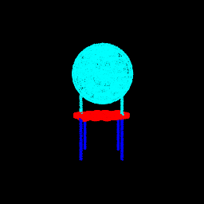 |  | Accuracy: 0.995


Discussion: The examples that the model was really good at are more standard looking chairs with four legs, a seat and a back. As we can see above the ones the model performed more poorly on are rather unique looking chairs, like a single seater sofa, a recliner with an extension or a curved chair/sofa. It is also not obvious to me, as a human, that the ground truth segmentation is undebatably the correct segmentations and the model predictions are not unreasonable.

## Robustness Analysis

### Varying num_points

Procedure: I have varied the number of points from 3 to 3000 (for better graphs as the performance doesn't vary beyond a certain point). The code to run this is in the jupyter notebook called index.ipynb and resides in the function `experiment_1`.

#### Segmentation


```python
experiment_1(main_seg, create_parser_seg)
```


    

    


        Num Points  Test Acc
    0            3  0.650459
    1            5  0.650891
    2           10  0.683468
    3           25  0.718574
    4           50  0.766548
    5           75  0.788028
    6          100  0.807066
    7          250  0.855144
    8          500  0.883702
    9         1000  0.900462
    10        2000  0.905737
    11        3000  0.906641


 Num Points | 3 | 10 | 25 | 50 | 100 | 250 | 1000  
---|---|---|---|---|---|---|---
 Ground truth |  |  |  |  |  |  | 
Predicted |  |  |  |  |  |  | 
Test Accuracy | 0.6505 | 0.6834 | 0.7186 | 0.7665 | 0.8071 | 0.8551 | 0.9004


Discussion: 
- It is very surprising that the accuracy is 65% even with just three points, but as we will see in the analysis of the next section, this model has learned virtually no invariance to rotations and predicts the segmentation largely on the basis of the height and hence it has such a high accuracy with such few points even though, as a human, I can see no reason for any form of sensible segmentation for <25 points. 
- Another reason for the high performance could be the fact that >60% of the test set is chairs and chairs do largely have a relatively easy segmentation on the basis of height. The above visualised example also indicates the same as the red colour segment belonging to the seat of the chair usually relaibly falls somewhere in the middle and the model could've memorized that.
- The performance doesn't appreciably improve beyond 1000 points


#### Classification


```python
experiment_1(main_cls, create_parser_cls, "Classification")
```


    

    


        Num Points  Test Acc
    0            3  0.246590
    1            5  0.267576
    2           10  0.365163
    3           25  0.670514
    4           50  0.866737
    5           75  0.906611
    6          100  0.927597
    7          250  0.946485
    8          500  0.966422
    9         1000  0.967471
    10        2000  0.971668
    11        3000  0.966422


 Num Points | 3 | 10 | 25 | 50 | 100 | 250 | 1000  
---|---|---|---|---|---|---|---
Point Cloud |  |  |  | 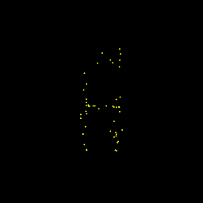 |  | 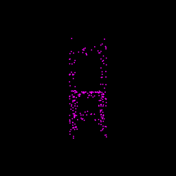 | 
Test Accuracy |  0.2455 | 0.3494 | 0.6684 | 0.8625 | 0.9203 | 0.9538 | 0.9717


Discussion: 
- Surprisingly, for the classification task even with as less as 100 points the classification accuracy is over 90 (~93), it is evident from the example visualised that the chair shape can be discerned. 
- Interestingly the performance doesn't improve beyond 1000 points

### Varying rotations

Procedure: I have varied the rotations about `y` axis (`azim`) and and wrt to the `xz` plane (`elev`) independently from 0 to 360. The code to run this is in the jupyter notebook called index.ipynb and resides in the function `experiment_2`. For the sake of speed, `num_points` was set to 1000 as we saw in the previous analysis that the performance doesn't improve much beyond it.


#### Segmentation


```python
ax = experiment_2(main_seg, create_parser_seg)
```


    

    


Discussion: The 3D plot shows a great variation in the space but it is difficult to identify strong trends, hence I made the following heatmap with Elevation Angle varying along a column and Azimuthal Angle varying along a row.


- It is evident that the best performance is in the configuration that the training data was in i.e. [(0, 180), (180, 0), (180, 360), (360, 180)]
- It is also clear that an elevation angle of 90 or 270 gives the worst performance regardless of the Azimuthal angle. This corresponds to looking at the object top down or bottom up which is in no way similar to the training data
- The model performance drops to as low as <20% accuracy indicating that the model is very sensitive to rotations
- While the heatmap provides more insight that the scatter plot, I have plotted a grid of predictions of one representative example in order to better understand what the model learned. Similar to the heatmap Elevation Angle varies along a column and Azimuthal Angle varies along a row.

 Elev\Azim | 0 | 45 | 90 | 135 | 180 | 225 | 270 | 315 | 360  
---|---|---|---|---|---|---|---|---|---
0 |  |  |  |  |  |  |  |  | 
45 |  |  |  |  |  |  |  |  | 
90 |  |  |  |  |  |  |  |  | 
135 |  |  |  |  |  |  |  |  | 
180 |  |  |  |  |  |  |  |  | 
225 |  |  |  |  |  |  |  |  | 
270 |  |  |  | 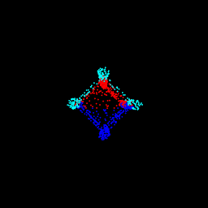 |  |  |  |  | 
315 |  |  |  |  |  |  |  |  | 
360 |  |  |  |  |  |  |  | 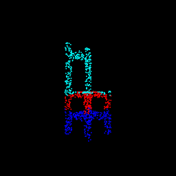 | 

- This grid I found to be the most revealing, our model is **NOT** rotation invariant! This makes sense as we skipped the blocks that allowed free transformations AND we did not have any data augmentation in our training pipeline to randomly rotate input point clouds while demanding a rotationally invariant output
- The model has largely learned how to segment a point cloud on the basis of the height and depth as we can see in the 270 row or the 90 showcasing the blind height based segmentation (a.k.a model is given the top-down or bottom-up view ) and from rows 360 and 0 which show the blind depth based segmentation (a.k.a when the model is given a side view).

#### Classification


```python
ax = experiment_2(main_cls, create_parser_cls, "Classification")
```


    

    


```python
ax = experiment_2(main_cls, create_parser_cls, "Classification")
```


    

    


Discussion: Similar to the segmentation task the scatter plot isn't the most revealing plot but it does show large variations.


- It is evident that the best performance is in the configuration that the training data was in i.e. [(0, 180), (180, 0), (180, 360), (360, 180)]
- The worst performing regions with accuracies as low as 10% are in isometric configurations like (45, 45) or (135, 45) with the absolute worst performers at (120, 60) or (120,300). Since this view is slightly different than the grid below I have visualised it separately as follows

 (120, 60) | (120, 300)
---|---
 | 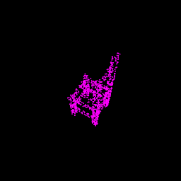

- Purple indicates the point cloud was correctly predicted as a chair whereas yellow or blue mean lamp or vase respectively.
- The grid below shows that largely the classification performance suffers if the view differs from that of the training data hence even this model is **NOT** rotation invariant!

 Elev\Azim | 0 | 45 | 90 | 135 | 180 | 225 | 270 | 315 | 360  
---|---|---|---|---|---|---|---|---|---
0 |  |  |  |  |  |  |  |  | 
45 |  |  |  |  |  |  |  |  | 
90 |  |  |  |  |  |  |  |  | 
135 |  |  |  |  |  |  |  | 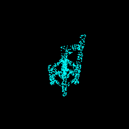 | 
180 |  |  |  |  |  |  |  |  | 
225 |  | 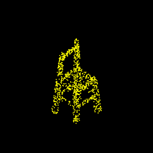 |  |  |  |  | 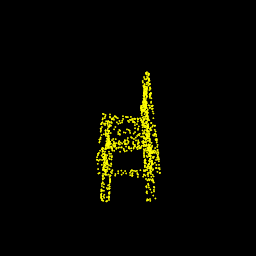 |  | 
270 |  |  | 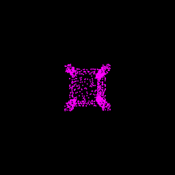 |  |  |  |  |  | 
315 |  |  |  |  |  |  |  |  | 
360 |  |  |  |  |  |  |  |  | 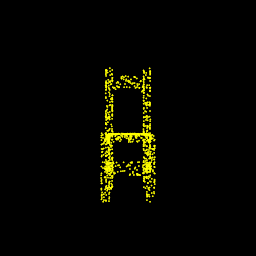

**Note**: While all visualisation above are rotating objects only a single view of this object corresponding to the appropriate angles were fed into the model.

*This work was done toward completion of Learning for 3D Vision (16-889) at CMU Robotics Institute*
